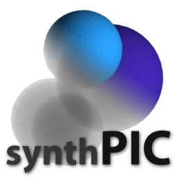
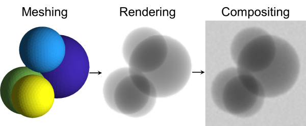
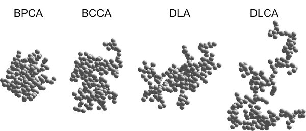
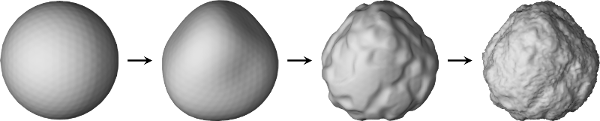
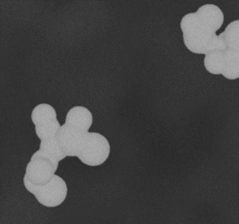
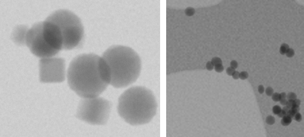
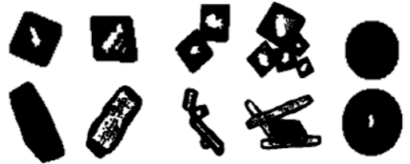

[](https://doi.org/10.1016/j.powtec.2019.10.020)
[](https://arxiv.org/abs/1907.05112)
[](https://github.com/maxfrei750/synthPIC4Matlab/blob/master/LICENSE) 



# SynthPIC4Matlab
The *synthetic Particle Image Creator (synthPIC)* is a Matlab toolbox to create synthetic training and benchmark data for image based particle analysis methods.

## Table of Contents
   * [SynthPIC4Matlab](#synthpic4matlab)
   * [Table of Contents](#table-of-contents)
   * [Workflow](#workflow)
   * [Features](#features)
   * [Citation](#citation)
   * [Setup](#setup)
   * [Getting started](#getting-started)

## Workflow


## Features

### Various Agglomeration Modes



### Various Primary Particle Shapes


### Layered Displacement 


### Different Shaders

#### Secondary Electron Microscopy


#### Transmission Electron Microscopy


#### Shadowgraphy


## Citation
If you use this repository for a publication, then please cite it using the following bibtex-entry:
```
@article{Frei.2019,
    author = {Frei, Max and Kruis, Frank Einar},
    year = {2019},
    title = {Image-Based Size Analysis of Agglomerated and Partially Sintered Particles via Convolutional Neural Networks},
    url = {https://doi.org/10.1016/j.powtec.2019.10.020}
}
```


## Setup

### In the operating system:
1. Clone or extract synthPIC4Matlab to a folder *F* of your choice (e.g. *../synthPIC4Matlab/*).
2. On Linux: Make the file where Matlab stores its search paths writable for your user. Therefore, run the following command in the terminal (adjust the path to match your Matlab installation):
```
sudo chown $USER /usr/local/MATLAB/R2018b/toolbox/local/pathdef.m
```

### In Matlab:
1. Start Matlab (on Windows: run it as administrator, so that Matlab can permanently save the changes to its search paths).
2. Navigate to the folder *F*, where you cloned/extracted synthPIC4Matlab.
3. Execute the following command in the command window:
```MATLAB
setup
```

## Getting started
The best place to get started are the example scripts in the *demos* folder.
